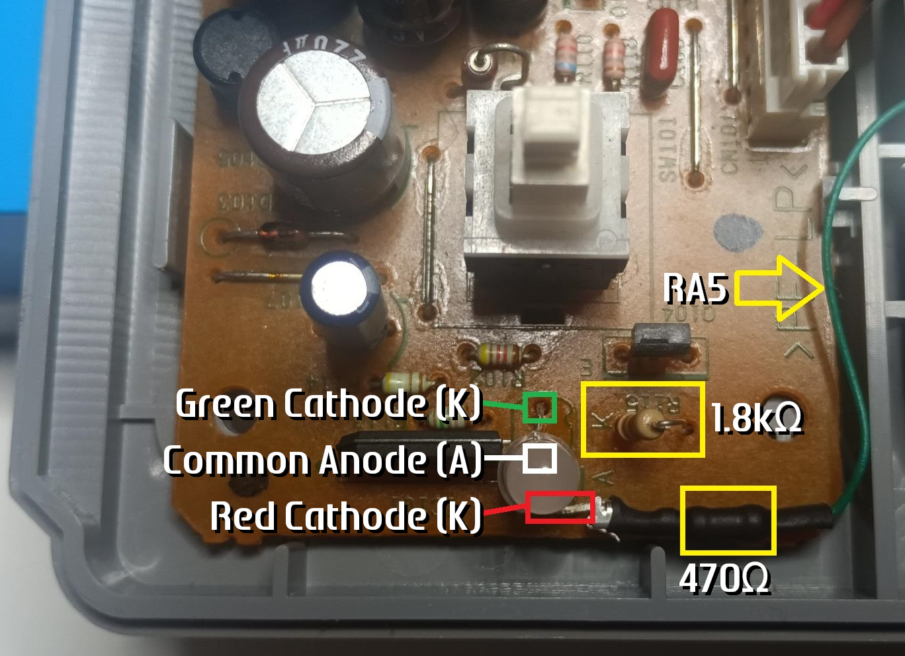

<a name="top"></a>

<a href="https://www.electroanalog.com">
  
</a>

# PSX In-Game Reset

[](LICENSE)
[](../../releases)
[]()
[]()

PSX-IGR is a combo-triggered reset mod for the PlayStation 1, enhancing reset control with controller-safe logic and LED feedback.  
Originally based on the [**PlayStation 1 Reset Mod**](https://github.com/pyroesp/PlayStation-1-Reset-Mod) (2019), this version introduces improved input handling as timed combo-triggered reset, and responsive LED support, while being fully optimized for the PIC16F18325/26.

---

## Table of Contents
- [How It Works](#how-it-works)
- [Configurable Timing Parameters](#configurable-timing-parameters)
- [Building & Flashing](#building--flashing)
- [PIC16F18325/26 Pinout](#pic16f1832526-pinout)
- [LED Wiring Options](#led-wiring-options)  

---

## Features

- ✅ Combo hold logic to prevent unintentional resets
- ✅ Combo feedback LED driven by asynchronous timer interrupt
- ✅ Reset feedback LED blink handled via the same non-blocking mechanism
- ✅ Support for PSU-mounted common-anode dual LED (RA5 control only)
- ✅ Optional support for 2-pin bicolor LED between RA4 and RA5 (dual-color feedback)
- ✅ Safe reset duration with post-reset lockout period
- ✅ Controller and GunCon combo support (based on ID)
- ✅ Behavior and timings fully configurable via `#define` macros

---

## How It Works

- Monitors SPI communication from the controller port.
- When a valid controller ID is detected, combo inputs are checked:
  - **Select + Start + L2 + R2** (standard controller)
  - **A + Trigger + B** (GunCon)
  - **Select + X + L2 + R2** (XStation combo)
- A combo must be held for `COMBO_HOLD` ms to trigger a reset.
- Reset is held for `SHORT_DELAY` or `LONG_DELAY` depending on combo.
- During reset, the LED provides visual feedback with `RESET_BLINK_COUNT` blinks.
- After reset, a lockout period (`REBOOT_DELAY`) ensures safe recovery before new inputs are accepted.

---

## Configurable Timing Parameters

You can modify these constants in `main.c` to adjust behavior:

```c
#define COMBO_HOLD           1250  // ms - Time combo must be held to trigger reset
#define RESET_BLINK_COUNT       3  // Number of blink cycles after reset
#define RESET_BLINK_TOTAL_MS  500  // ms - Total blink duration
#define RESET_BLINK_DELAY_MS  200  // ms - Delay after blink before returning to idle
```
---

## Building & Flashing

### Source Code (Optional Compilation)
To build from source:
- Use [MPLAB X IDE](https://www.microchip.com/en-us/tools-resources/develop/mplab-x-ide) and [XC8 Compiler](https://www.microchip.com/en-us/tools-resources/develop/mplab-xc-compilers)
- Target microcontroller: **PIC16F18325** or **PIC16F18326**
- Set `__CONFIG` fuses appropriately for:
  - Internal 32 MHz oscillator
  - MCLR enabled
- Flash using ICSP with PICKit 3 or newer

### ⚡ Precompiled `.hex`
For convenience, a precompiled **`.hex` file** is included in the [Releases](../../releases) section.  
This allows quick flashing using:

- **MPLAB IPE 6.20 or newer**
- **PICKit 3** or compatible programmer

No source compilation is required if using the `.hex`.

---

## PIC16F18325/26 Pinout

| Pin | Name | Function |
|-----|------|----------|
| 1   | VCC  | +3.3V |
| 2   | RA5  | COMBO/RESET - PRIMARY LED → Sinking control [-] for PSU 3-pin bicolor LED |
| 3   | RA4  | COMBO/RESET - AUXILIARY LED → For 2-pin bicolor LED |
| 4   | RA3  | ICSP MCLR/VPP |
| 5   | RC5  | RESET |
| 6   | RC4  | *(not used)* |
| 7   | RC3  | DEBUG |
| 8   | RC2  | SPI CMD |
| 9   | RC1  | SPI DATA |
| 10  | RC0  | SPI CLK |
| 11  | RA2  | SPI SS |
| 12  | RA1  | ICSP CLK |
| 13  | RA0  | ICSP DAT |
| 14  | VSS  | GND |

---

## LED Wiring Options

> [!IMPORTANT]
> **Using a feedback LED is optional**. However, if you choose to use one, the following rules **must** be followed to ensure correct function and proper brightness.

### LED Configurations Overview

#### 🔴 RA5 (pin 2) - Primary LED Output
- Drives the LED during **combo detection** and **reset blink**.
- **RA5** is used either **alone** or together with **RA4**.
- Compatible with:
  - 🟢🔴 **3-pin common-anode LED**: Connect 🔴 **red cathode** to RA5 via a **470 Ω resistor**.
  - 🟡 **Single LED**: Anode to **VCC**, cathode to **RA5** via a **100-470 Ω resistor**.

#### 🟢 RA4 (pin 3) - Auxiliary LED Output
- Used **only** when connecting a **2-pin bicolor (antiparallel)** LED **between RA4 and RA5**.
- Provides **idle indication** and supports **dual-color feedback**.
- Not intended for **3-pin common-anode LED** or **single LED**  use.

> [!NOTE]
> If you're using a **3-pin common-anode LED**, the **green cathode resistor** inside the PSU is usually **120-130 Ω**.  
> To balance green brightness with RA5's red output, **replace this resistor with 1.8 kΩ**.

#### 🟢🔴 2-Pin Bicolor (Antiparallel) LED
- Connect between RA4 and RA5 using a **single 100 Ω resistor** in series with either pin (no GND or VCC required).
- Provides dual-color feedback:
  - 🟢 Green during **idle**
  - 🔴 Red during **combo**
  - 🔴⚫ Red blink during **reset**
  - ⚫ OFF during **post-reset delay**

---

### LED Assignment Table

| System State          | RA4 (pin 3)<br>🟢 | RA5 (pin 2)<br>🔴 | 2-Pin Bicolor LED (antiparallel)<br>🟢🔴 | Single Red LED or 3-Pin Red Terminal<br>🔴  |
|-----------------------|----------------|-----------------|----------------------------------|---------------------------------------|
| Idle                  | LO             | HI              | 🟢 Green (RA5 short pin)         | ⚫ OFF                               |
| Combo detected        | HI             | LO              | 🔴 Red                           | 🔴 ON                                |
| Reset (triggered)     | HI             | LO/HI toggle    | 🔴⚫ Red Blinking               | 🔴⚫ Red Blinking                    |
| Post-reset delay      | Hi-Z           | Hi-Z            | ⚫ OFF                           | ⚫ OFF                               |

> [!WARNING]
> - RA4 is intended to work in **push-pull** with RA5 for 2-pin bicolor (antiparallel) LEDs.
> - RA4 provides **idle indication** but stays constant during reset. **Only RA5 blinks**.
> - RA4 provides only partial indication, and its use in combination with **VCC or GND** is **not recommended**.
> - ⚠️ Always use at least one **100 Ω** resistor in series with the LED to prevent hardware damage.
  
<details>
<summary><b>❓ Expected LED behavior when only RA4 is used for LED - Click to expand</b></summary><br>

| LED Type           | Other Leg Connected To | Idle      | Combo Detected | Reset (triggered)  |
|--------------------|------------------------|-----------|----------------|--------------------|
| 2-Pin Bicolor (1)  | GND                    | ⚫ OFF    | 🔴 Red        | ⚫ OFF             |
| 2-Pin Bicolor (1)  | VCC                    | 🟢 Green  | ⚫ OFF        | ⚫ OFF             |
| 2-Pin Bicolor (2)  | GND                    | ⚫ OFF    | 🟢 Green      | ⚫ OFF             |
| 2-Pin Bicolor (2)  | VCC                    | 🔴 Red    | ⚫ OFF        | ⚫ OFF             |
| Single LED (A)     | GND                    | ⚫ OFF    | 🟡 ON         | ⚫ OFF             |
| Single LED (A)     | VCC                    | ⚫ OFF    | ⚫ OFF        | ⚫ OFF             |
| Single LED (K)     | GND                    | ⚫ OFF    | ⚫ OFF        | ⚫ OFF             |
| Single LED (K)     | VCC                    | 🟡 ON     | ⚫ OFF        | ⚫ OFF             |

>💡 Note: 2-pin bicolor LEDs long pin is usually marked as “1”

</details>

---

### Summary

> [!NOTE]
> - 🔴 **RA5** is the primary output for LED signaling, handling both **combo detection** and **reset blink**.
> - 🟢 **RA4** acts as a secondary output and only contributes when using a **2-pin bicolor (antiparallel)** LED connected between **RA4 and RA5**.
> - 🟡 For **single LEDs**, connect the **anode (A) to VCC** and the **cathode (K) to RA5** via a **100-470 Ω resistor**.

<details>
<summary> <b>Example wiring for a 3-pin common-anode LED (Red/Green) - Click to expand</b> </summary>

> <br>
>
> - 🟢 **Green cathode (K)** is connected to the **PSU K line** via a **1.8k Ω resistor**  
>   - This replaces the original PSU 130 Ω resistor to balance brightness  
>   - The green side remains **always on** when the system is powered  
> - 🔘 **Anode (A)** is connected to the **PSU A line (VCC)**  
>   - This is the common anode shared by both LED colors  
> - 🔴 **Red cathode (K)** is connected to **RA5** (pin 2) of the PIC via a **470 Ω resistor**  
>   - **Only RA5 (red cathode)** is used for signaling (combo detection and reset blink)
> - 🟠 All feedback signaling will appear **orange**, since the green side remains always on 
>
</details>


---

## License

This is a derivative work licensed under the [Creative Commons Attribution-ShareAlike 4.0 International (CC BY-SA 4.0)](https://creativecommons.org/licenses/by-sa/4.0/).

---

## Credits

Modified and extended by **Electroanalog® VICE (2025)**  
Based on [*PlayStation 1 Reset Mod*](https://github.com/pyroesp/PlayStation-1-Reset-Mod) by **pyroesp (2019)**  

*PlayStation is a registered trademark of Sony Interactive Entertainment LLC (SIE), formerly Sony Computer Entertainment Inc. (SCE). All rights reserved.*

---

## Topics / Tags

`ps1` `psx` `playstation` `igr` `reset-mod` `pic16f18325` `pic16f18326` `modchip` `led-feedback` `guncon` `xstation` `diy-console-mod` `retro-gaming`

